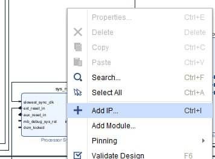
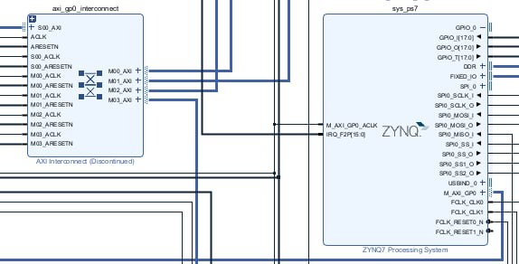
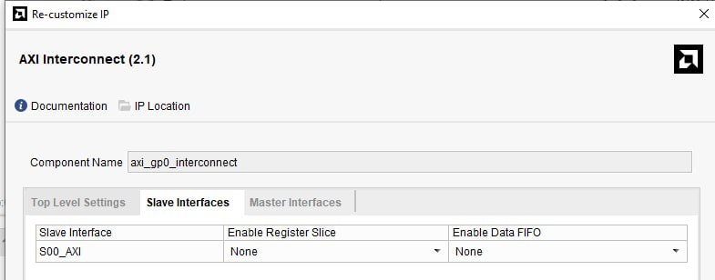
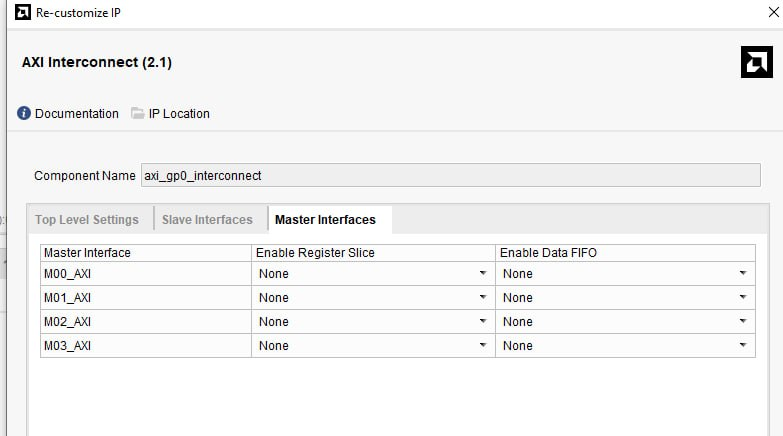
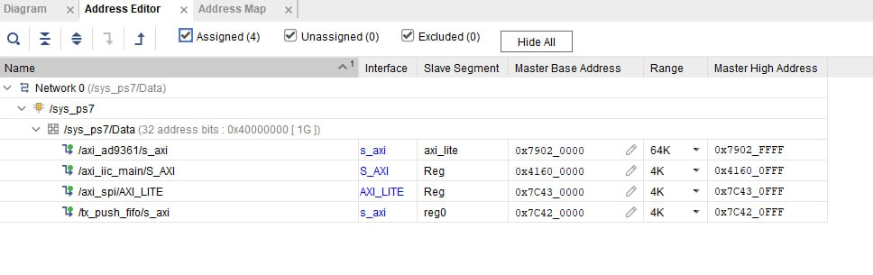

# MicroBlaze — Beginner Introduction

## 1. What is MicroBlaze?

**MicroBlaze is a CPU implemented inside an FPGA.**

Normally, a CPU is a physical chip inside a computer or microcontroller.
MicroBlaze is different: it is a **soft CPU core** that is implemented using the FPGA's programmable logic resources.

*At this point, you do not need to understand what AXI Interconnect does.*

*Think of it simply as a connection between MicroBlaze and the hardware peripherals.*

*We will explain how this connection works in Section 4 — AXI and AXI Interconnect.*

For example:

```text
                    FPGA
┌─────────────────────────────────────────────┐
│                                             │
│   ┌──────────────┐                          │
│   │  MicroBlaze  │  ← CPU                   │
│   │     CPU      │                          │
│   └──────┬───────┘                          │
│          │ AXI                              │
│          ▼                                  │
│   ┌──────────────┐                          │
│   │ AXI          │                          │
│   │ Interconnect │                          │
│   └──────┬───────┘                          │
│          │                                  │
│     ┌────┴───────────┐                      │
│     │                │                      │
│     ▼                ▼                      │
│   FIFO             Other                    │
│   Peripheral       Peripherals              │
│                                             │
└─────────────────────────────────────────────┘
```

The important idea is:

> **MicroBlaze behaves like a small CPU, but the CPU itself exists inside the FPGA.**

Because it is a CPU, we can write programs for it in **C**.

For example:

```c
int main()
{
    while (1)
    {
        // CPU executes C code here
    }

    return 0;
}
```

The C program is compiled for the MicroBlaze processor and then loaded into the FPGA system.

---

# 2. Why do we need MicroBlaze?

An FPGA normally executes hardware logic.

For example, we can create:

```text
Counter
UART
FIFO
SPI
PWM
FSK Modulator
```

These are hardware blocks.

But sometimes we want to perform operations that are easier to describe as software.

For example:

```c
for (int i = 0; i < 100; i++)
{
    send_data(i);
}
```

Instead of building a complicated hardware state machine for this, we can use MicroBlaze.

So we can combine:

```text
Software                    Hardware
─────────                   ─────────
MicroBlaze                  FIFO
C program                   FSK modulator
                            UART
                            SPI
                            GPIO
```

This is one of the main advantages of using MicroBlaze.

---

# 3. MicroBlaze is a CPU, not a peripheral

It is important to understand the difference.

MicroBlaze is the **processor**.

The FIFO is a **peripheral**.

For example:

```text
             CPU
        ┌────────────┐
        │ MicroBlaze │
        └─────┬──────┘
              │
              │ AXI
              ▼
        ┌────────────┐
        │    FIFO    │
        └────────────┘
```

The MicroBlaze executes instructions.

The FIFO stores data.

MicroBlaze can tell the FIFO:

> "Write this value."

or:

> "Read this value."

---

# 4. How does MicroBlaze communicate with hardware?

Now we need to answer an important question:

> How can a C program running on MicroBlaze control an FPGA peripheral?

For this project, the answer is **AXI**.

AXI is a communication protocol commonly used inside Xilinx/Vivado FPGA systems.

The architecture is:

```text
C program
    │
    ▼
MicroBlaze CPU
    │
    │ AXI
    ▼
AXI Interconnect
    │
    ▼
Peripheral
```

The **AXI Interconnect** connects the MicroBlaze CPU to one or more peripherals.

You can think about it as a routing system.

For example, if MicroBlaze wants to access a FIFO, the AXI Interconnect receives the request and sends it to the FIFO.

   # 5. How MicroBlaze accesses peripherals

Now we know that MicroBlaze is a CPU running C code.

But there is an important question:

> **How can a C program access hardware peripherals inside the FPGA?**

For example, imagine that our FPGA contains:

```text
                    FPGA
┌─────────────────────────────────────────────┐
│                                             │
│  ┌──────────────┐                           │
│  │  MicroBlaze  │                           │
│  │     CPU      │                           │
│  └──────┬───────┘                           │
│         │                                   │
│         │                                   │
│         ▼                                   │
│  ┌──────────────────┐                       │
│  │ AXI Interconnect │                       │
│  └──────┬───────────┘                       │
│         │                                   │
│    ┌────┼───────────────┐                   │
│    │    │               │                   │
│    ▼    ▼               ▼                   │
│   FIFO GPIO            UART                 │
│                                             │
└─────────────────────────────────────────────┘
```

We have **one CPU and many peripherals**.

We want to be able to write C code such as:

```c
fifo_write(0x55);
```

or:

```c
gpio_write(1);
```

and have the correct hardware peripheral receive the data.

This is where the **AXI Interconnect** is useful.

---

## 5.1 The Interconnect as a router

The simplest way to think about the AXI Interconnect is:

> **It is a router between the CPU and the peripherals.**

MicroBlaze generates a transaction containing an address and, for a write, some data.

For example:

```text
Address = 0x40000000
Data    = 0x55
```

The Interconnect looks at the address and determines which peripheral should receive the transaction.

For example:

```text
Address range              Peripheral

0x40000000 - 0x400000FF    FIFO

0x40000100 - 0x400001FF    GPIO

0x40000200 - 0x400002FF    UART
```

So:

```text
MicroBlaze
    │
    │ "Write 0x55 to 0x40000000"
    ▼
AXI Interconnect
    │
    │ Address belongs to FIFO
    ▼
FIFO
```

And:

```text
MicroBlaze
    │
    │ "Write 1 to 0x40000100"
    ▼
AXI Interconnect
    │
    │ Address belongs to GPIO
    ▼
GPIO
```

The important point is that **MicroBlaze does not need to know how the peripheral is physically connected**.

It only needs to know its address.

---

## 5.2 Address mapping

When we create a system in Vivado, we need to assign address ranges to the peripherals.

For example:

```text
MicroBlaze address space

0x00000000
     │
     │ RAM
     │
0x10000000
     │
     │
0x40000000 ───── FIFO
     │
0x40000100 ───── GPIO
     │
0x40000200 ───── UART
     │
0x40000300
```

The Interconnect uses this address map to decide where each AXI transaction should go.

The exact addresses are normally configured/generated by Vivado.

The important concept is:

> **Each peripheral gets an address range.**

The range also determines how much address space is available for that peripheral.

For example:

```text
FIFO:
Base address = 0x40000000
Range        = 0x100 bytes
```

means that the FIFO occupies:

```text
0x40000000 → 0x400000FF
```

inside the MicroBlaze address space.

---

# 5.3 Peripherals usually contain registers

A peripheral is usually not just one value.

It can contain several **registers**.

For example, imagine our FIFO peripheral has three registers:

```text
FIFO_BASE = 0x40000000

Offset       Register

0x00         DATA
0x04         STATUS
0x08         CONTROL
```

The actual addresses are therefore:

```text
DATA:
0x40000000 + 0x00 = 0x40000000

STATUS:
0x40000000 + 0x04 = 0x40000004

CONTROL:
0x40000000 + 0x08 = 0x40000008
```

So we can think about a peripheral like this:

```text
              FIFO peripheral
       ┌─────────────────────────┐
       │                         │
       │ +0x00  DATA             │
       │ +0x04  STATUS           │
       │ +0x08  CONTROL          │
       │                         │
       └─────────────────────────┘
```

The **base address** identifies the peripheral.

The **offset** identifies a particular register inside that peripheral.

---

# 5.4 Accessing registers from C

We can define the registers in C:

```c
#define FIFO_BASE     0x40000000

#define FIFO_DATA     (FIFO_BASE + 0x00)
#define FIFO_STATUS   (FIFO_BASE + 0x04)
#define FIFO_CONTROL  (FIFO_BASE + 0x08)
```

Now we can write to a register:

```c
*(volatile uint32_t *)FIFO_DATA = 0x55;
```

This means:

> Write `0x55` to the FIFO DATA register.

Or read a register:

```c
uint32_t status;

status = *(volatile uint32_t *)FIFO_STATUS;
```

This means:

> Read the FIFO STATUS register.

So from C, accessing hardware can look very similar to accessing memory.

---

# 5.5 What does the peripheral look like in HDL?

A very simplified peripheral could contain registers like this:

```text
                 AXI
                  │
                  ▼
        ┌───────────────────┐
        │ AXI interface     │
        │                   │
        │ address           │
        │ write data        │
        │ read data         │
        └─────────┬─────────┘
                  │
                  ▼
        ┌───────────────────┐
        │ Registers         │
        │                   │
        │ DATA              │
        │ STATUS            │
        │ CONTROL           │
        └───────────────────┘
```

For example, the HDL logic could conceptually look like:

```verilog
reg [31:0] data_reg;
reg [31:0] control_reg;

always @(posedge clk) begin
    if (write_enable) begin

        case (address_offset)

            8'h00:
                data_reg <= write_data;

            8'h08:
                control_reg <= write_data;

        endcase

    end
end
```

This is intentionally simplified.

The actual AXI4-Lite peripheral has additional logic for the AXI protocol.

The important part is the idea:

```text
AXI write
    │
    ▼
address offset
    │
    ├── 0x00 → DATA register
    │
    └── 0x08 → CONTROL register
```

---

# 5.6 Complete example

Now let's connect everything together.

Suppose we have:

```text
FIFO_BASE = 0x40000000
```

and inside the FIFO:

```text
0x00 → DATA
0x04 → STATUS
0x08 → CONTROL
```

Our C program contains:

```c
#include <stdint.h>

#define FIFO_BASE     0x40000000

#define FIFO_DATA     (FIFO_BASE + 0x00)
#define FIFO_STATUS   (FIFO_BASE + 0x04)

int main()
{
    /* Write data to FIFO */
    *(volatile uint32_t *)FIFO_DATA = 0x55;

    /* Read FIFO status */
    uint32_t status;
    status = *(volatile uint32_t *)FIFO_STATUS;

    while (1)
    {
    }

    return 0;
}
```

Now look at what happens when this line executes:

```c
*(volatile uint32_t *)FIFO_DATA = 0x55;
```

The complete path is:

```text
C program
    │
    │ write 0x55
    │
    │ address = 0x40000000
    ▼
MicroBlaze
    │
    │ AXI write transaction
    │
    │ address = 0x40000000
    │ data    = 0x55
    ▼
AXI Interconnect
    │
    │ Address mapping:
    │ 0x40000000 → FIFO
    ▼
FIFO AXI interface
    │
    │ offset = 0x00
    ▼
DATA register
    │
    │
    ▼
data_reg = 0x55
```

So the complete idea is:

> **The C program generates an address. MicroBlaze sends this address through AXI. The Interconnect uses the address map to select the correct peripheral. The AXI interface inside that peripheral uses the address offset to select the correct register.**

---

# 5.7 Read operation

The same mechanism works in the opposite direction.

Suppose the C program executes:

```c
uint32_t status;

status = *(volatile uint32_t *)FIFO_STATUS;
```

The path becomes:

```text
MicroBlaze
    │
    │ AXI READ
    │
    │ address = 0x40000004
    ▼
AXI Interconnect
    │
    │ 0x40000004 → FIFO
    ▼
FIFO
    │
    │ offset = 0x04
    ▼
STATUS register
    │
    │ read data
    ▼
AXI Interconnect
    │
    ▼
MicroBlaze
    │
    ▼
status variable
```

So:

```text
C code
  ↓
MicroBlaze
  ↓
AXI
  ↓
Interconnect
  ↓
Peripheral
  ↓
Register
```

for a write, and the same path in reverse for a read.

---

# 6. Practical Vivado flow

Everything described above (CPU, AXI Interconnect, peripherals, address map) is not just theory — it is exactly what you configure by hand inside the Vivado Block Design when you build a MicroBlaze/Zynq system. Below is the typical practical flow, step by step, illustrated with real screenshots taken from Vivado.

## 6.1 Add the CPU IP

Open the IP Catalog and search for the processor IP (e.g. `mic` to find **MicroBlaze**, or the equivalent Zynq Processing System IP).


## 6.2 Add IP to the block design

Inside the Block Design canvas, right‑click and choose **Add IP…** to insert a new IP core (CPU, interconnect, or peripheral) into the diagram.



## 6.3 Connect the CPU to the AXI Interconnect

The CPU's AXI master port(s) are wired through an **AXI Interconnect** to the peripherals and to the Processing System (for a Zynq-based design). This is the same routing concept explained in Section 5.1 — here it is shown as it actually looks in the Block Design diagram.



## 6.4 Configure the Interconnect — Slave Interfaces

Double‑click the AXI Interconnect IP to re‑customize it. On the **Slave Interfaces** tab you configure how many AXI slave ports the interconnect exposes toward the CPU (master) side, and options such as register slices / data FIFOs.



## 6.5 Configure the Interconnect — Master Interfaces

On the **Master Interfaces** tab you configure the AXI master ports going out to each peripheral (M00_AXI, M01_AXI, …). Each of these master ports will later be connected to one peripheral (FIFO, GPIO, UART, etc.).



## 6.6 Assign the address map

Finally, open the **Address Editor** tab in Vivado. This is where the address ranges from Section 5.2 are actually assigned: each peripheral connected to the interconnect gets a base address and a range, exactly like the `FIFO_BASE`, `axi_iic_main`, `axi_spi`, etc. addresses used later in the C code.



---

With this address map generated, the addresses used in Section 5.4–5.7 (`#define FIFO_BASE 0x40000000`, etc.) are no longer arbitrary examples — they come directly from what Vivado assigns here, and Xilinx SDK/Vitis will auto-generate the matching `xparameters.h` header for your C program.
