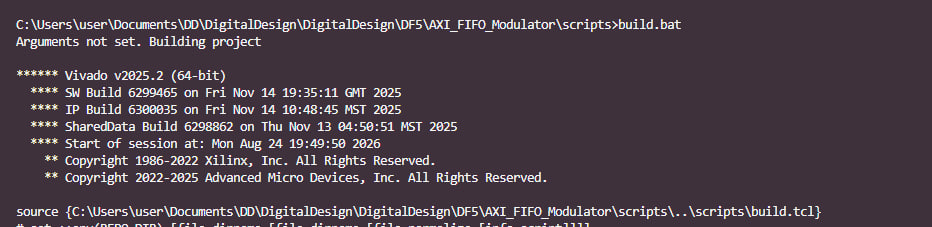

# DF5 DOC — покажчик документації

Тут зібрані навчальні матеріали до DF5 (MicroBlaze + AXI FIFO + FSK-модулятор). Кожен файл —
окрема тема, читати можна послідовно зверху вниз при першому знайомстві, або точково коли треба
конкретна відповідь.

## Що тут є і навіщо

| Файл | Навіщо | Статус |
|---|---|---|
| [`MicroBlaze.md`](MicroBlaze.md) | Теорія: що таке MicroBlaze, навіщо він, як CPU через AXI Interconnect ходить у регістри периферії (з прикладами на C). Читати першим, якщо AXI/адресний простір ще не звичні. | готово |
| [`VivadoFlow.md`](VivadoFlow.md) | Практика: покрокова інструкція по Vivado — генерація проєкту скриптами, Block Design, підключення MicroBlaze, HDL wrapper, експорт `.xsa`. Що конкретно клацати, зі скріншотами. | готово |
| [`VitisFlow.md`](VitisFlow.md) | Практика: як з `.xsa` створити Platform/Application Component у Vitis, типові пастки (не той `.xsa`/CPU, забутий `main.c`) і звірка адрес з `xparameters.h` проти Vivado. | готово |
| [`FSK.md`](FSK.md) | Теорія: що таке FSK (Frequency-Shift Keying) і чому саме цей варіант модуляції обраний як "дуже спрощений" для DF5. | TODO — заготовка |

Постановка самого завдання (що зробити, регістрова карта, що перевірити) — не тут, а в
[`../AXI_FIFO_Modulator/task_readme.md`](../AXI_FIFO_Modulator/task_readme.md). Пояснення
build-скриптів і `.xdc` — в
[`../AXI_FIFO_Modulator/docs/scripts_and_xdc_guide.md`](../AXI_FIFO_Modulator/docs/scripts_and_xdc_guide.md).
Ця `DOC/` папка — про загальну теорію (MicroBlaze/AXI/FSK) і про сам Vivado/Vitis flow, а не про
конкретний RTL цього проєкту.

## Як додати новий документ або картинку

1. **Новий `.md` файл** — клади прямо в `DF5/DOC/`, коротка назва теми (`Назва.md`), заголовок
   `# Назва` на першому рядку. Додай рядок у таблицю вище (файл, навіщо, статус).
2. **Картинки до конкретного документа** — окрема підпапка `img/img_<НазваДокумента>/` (як
   `img/img_VivadoFlow/`, `img/img_MicroBlaze/`), а не одним спільним звалищем у `img/`. Це нам вже
   боляче вдарило один раз: коли картинки лежали пласко в `img/*.jpg`, при реорганізації довелось
   вручну поправляти шляхи в `MicroBlaze.md`.
3. **Ім'я файлу картинки** — коротке й по суті кроку, що на ній показано (`setup_1.jpg`,
   `bd2.jpg`, `mb1.jpg`), не `Screenshot_2026_08_24.jpg`.
4. **Посилання на картинку** з `.md` файлу в `DF5/DOC/` — відносний шлях
   `img/img_<НазваДокумента>/файл.jpg`, у markdown-синтаксисі з описовим alt-текстом:
   ```markdown
   
   ```
   Alt-текст — не "Screenshot 1", а речення про те, що конкретно на екрані і чому це важливо для
   кроку.
5. Якщо документ ще не написаний, а тема відома — лиши заготовку одним рядком
   (`here will be info about ...`, як зараз у `VitisFlow.md`/`FSK.md`) і познач статус "TODO" в
   таблиці вище, щоб було видно, що ще не готово, а не забуто.
