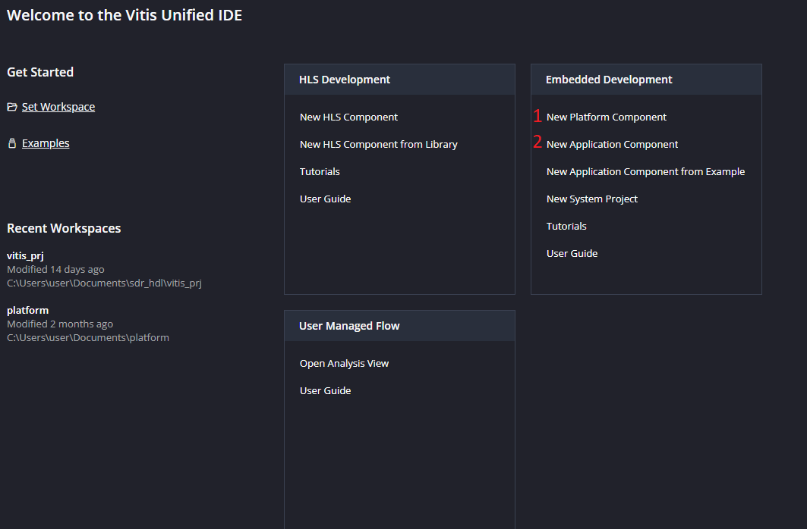
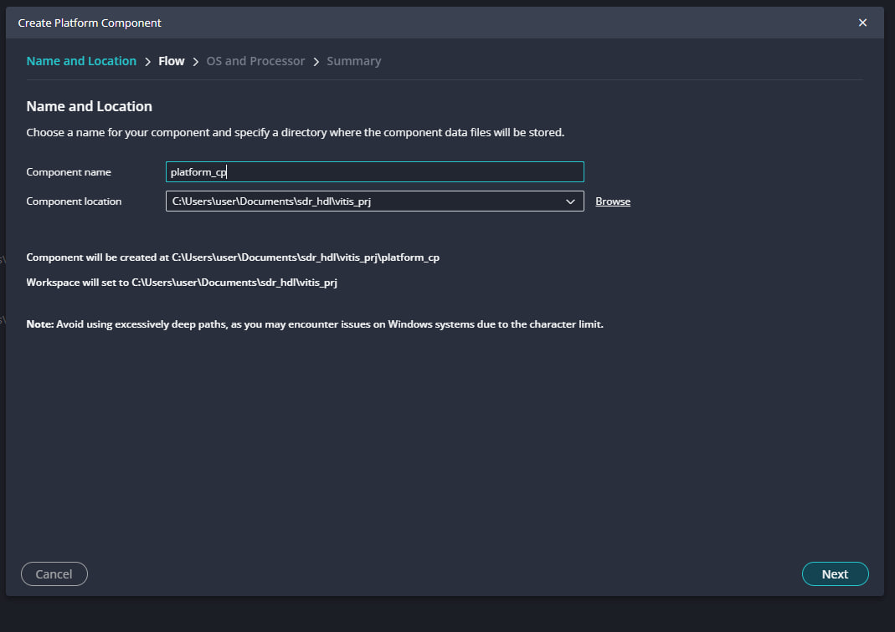
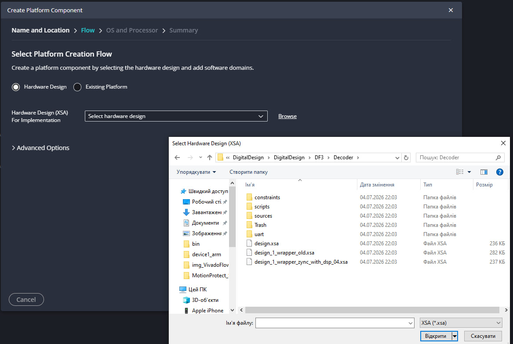
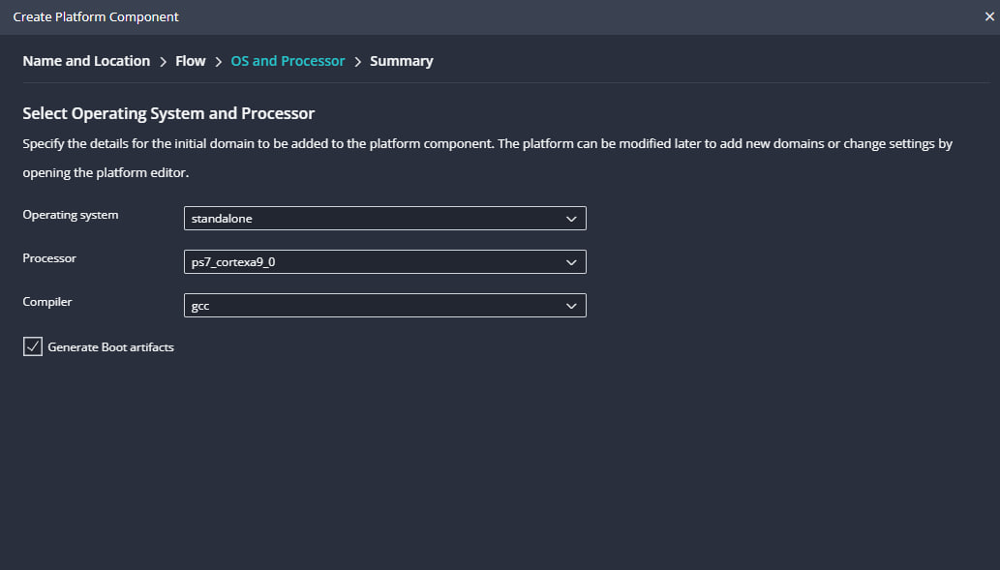
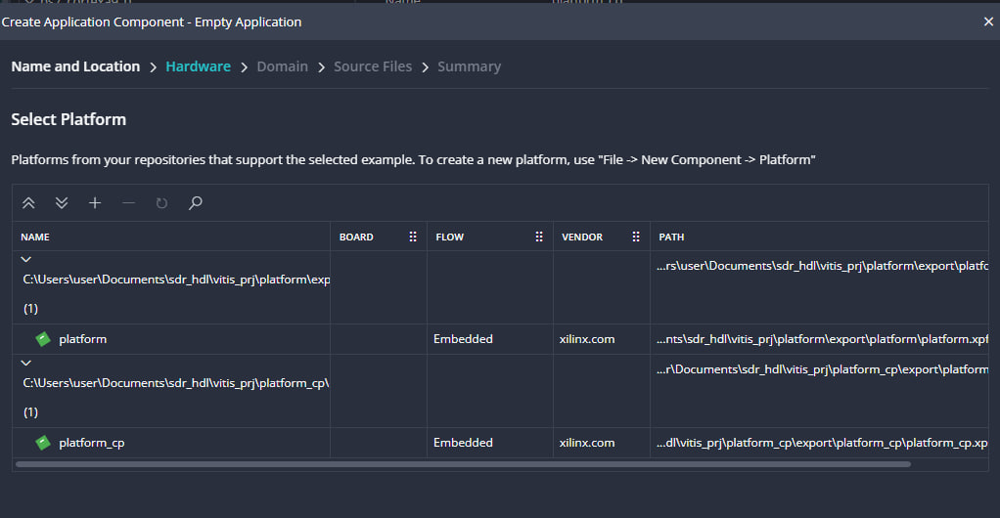
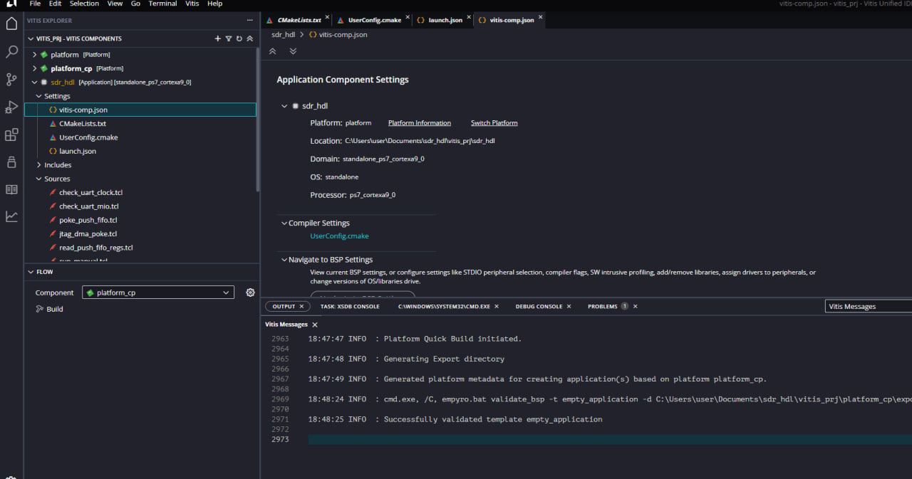
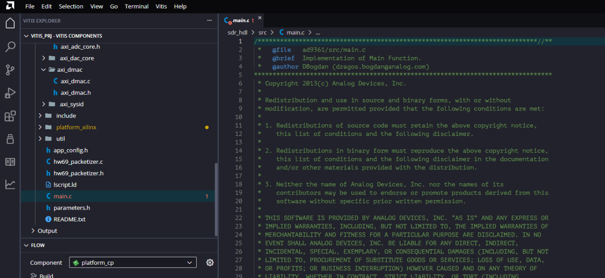
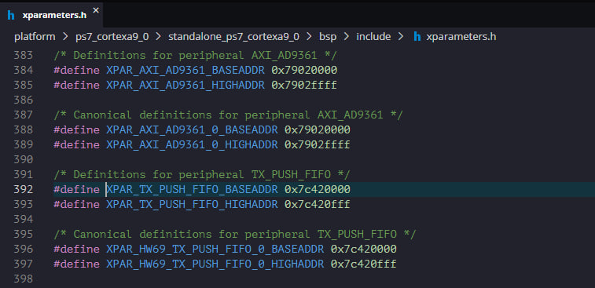
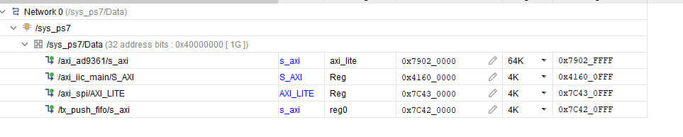

# Vitis Flow — Platform, Application, and Verifying

This picks up exactly where [`VivadoFlow.md`](VivadoFlow.md) Section 4 stops: you already have a
`.xsa` exported from Vivado (with bitstream included). Here we turn that `.xsa` into a Vitis

---

## 1. Create a Workspace

On first launch, Vitis Unified IDE asks you to **Set Workspace** — the folder that will hold every
Platform/Application component you create in this session. Under **Embedded Development**, the
flow always goes in this order: **1 New Platform Component** first, **2 New Application Component**
second (an application always builds against an already-created platform, not the other way
around).

---

## 2. Create the Platform (from the `.xsa`)

**Name and Location** — give the platform component a name and pick where it's stored.

**Flow -> Hardware Design (XSA)** — browse to the `.xsa` file.

**OS and Processor** — double-check the **Processor** dropdown against what CPU you actually have
in your design (`microblaze_0` for DF5). The screenshot below is from a different, Zynq-based
example, so it shows `ps7_cortexa9_0` instead — just keep in mind which CPU is yours and make sure
the dropdown actually shows it before creating the application on top of it.

---

## 3. Create the Application

**Select Platform** — the Application wizard lists every platform component present in the current
workspace. If you (or an earlier example) built more than one platform, make sure you pick the one
you just created from *your* `.xsa`.

**If you start from a clean/empty template, add `main.c` yourself.** Choosing "Empty Application"
gives you a Sources folder with only the generated build config (`CMakeLists.txt`,
`UserConfig.cmake`, `launch.json`, `vitis-comp.json`) and whatever utility `.tcl` scripts came with
the platform — **no `main.c`**. The screenshot below is exactly that state right after creation:

You add the C source by hand: right-click **Sources** -> **New File** and name
it `main.c`. For DF5, this is where you drop in
[`../AXI_FIFO_Modulator/vitis/app_component/src/main.c`](../AXI_FIFO_Modulator/vitis/app_component/src/main.c)
(the minimal test app for `axi_fifo_regs` described in `task_readme.md`). Once real sources are
added, the tree looks populated instead — like this unrelated but fuller example project:

The **Vitis Components** panel on the left is also where the generated **launch configurations**
(`launch.json`) live once you build — these are the Run/Debug profiles Vitis uses to program the
board and start a debug session; you don't hand-write them, but that's where to look for them if a
Run/Debug button seems to be doing nothing.

---

## 4. Verify addresses against Vivado (`xparameters.h`)

Once the platform is built, Vitis generates `xparameters.h` under
`platform/<processor>/standalone_<processor>/bsp/include/xparameters.h`. This is the file that
turns "peripheral instance name in the block design" into the `XPAR_..._BASEADDR` macro your C code
actually uses (see `MicroBlaze.md` Section 5.4).

Cross-check that value against the **Address Editor** in the Vivado block design (the same view
used in `VivadoFlow.md`/`MicroBlaze.md` Section 6.6) for the *same* peripheral instance:

`0x7c420000` in both places — that's the check passing. For DF5, do the same comparison for your
own peripheral: find `axi_fifo_regs`'s base address in Vivado's Address Editor, then confirm the
matching `XPAR_AXI_FIFO_REGS_0_S_AXI_BASEADDR` (exact macro name depends on the instance name you
gave it in the block design) in the generated `xparameters.h` has the identical value — this is
exactly the placeholder `FIFO_MOD_BASE` in `main.c` that needs to be filled in.

If the two don't match (or the macro doesn't exist at all), the usual cause is one of:
- The `.xsa` exported from Vivado is stale — re-export it (`build.bat -xsa`) after your latest
  build, since it was already implemented before the address map changed.
- The Vitis platform wasn't re-generated against the newer `.xsa` — re-run **Platform -> Build**,
  or re-create the platform component pointing at the fresh `.xsa`.
