# Vivado Flow — Project Setup, Block Design, MicroBlaze, XSA Export

This guide walks through the practical Vivado workflow,
scripts, building a Block Design (IP Integrator), wiring up MicroBlaze, and exporting the hardware
platform (`.xsa`) that Vitis will consume.

It covers **what to click and why**. For the *theory* behind MicroBlaze/AXI/address maps, read
[`MicroBlaze.md`](MicroBlaze.md) first — this document assumes you already know what an AXI
Interconnect and a register map are.

---

## 1. Setup the environment via scripts

Do **not** create the Vivado project by hand in the GUI. All project state (part number, source
files, constraints) is generated from the scripts in `AXI_FIFO_Modulator/scripts/` — see
[`../AXI_FIFO_Modulator/docs/scripts_and_xdc_guide.md`](../AXI_FIFO_Modulator/docs/scripts_and_xdc_guide.md)
for what each script actually does. This means:

- The project can be regenerated from scratch on any machine (nothing important lives only inside
  the binary `.xpr`/`project/` folder, which is not committed to git).
- When you only change RTL, you don't need to touch the GUI at all — edit the `.vhd` file in
  VS Code (or any editor), then re-run just the synthesis step to get a new bitstream.
- When you need to edit the **Block Design** (the graphical CPU+peripherals diagram), you do open
  the Vivado GUI — the BD itself is edited visually, there is no script shortcut for that part.

Run it from the project's `scripts/` folder:

```bash
cd AXI_FIFO_Modulator/scripts
./build.bat
```

This creates the project the first time (or reopens it), scans `sources/rtl` and `constraints/`,
and adds every file it finds.


Vivado creates a `project/` folder next to `scripts/`. This folder is the actual generated Vivado
project (`.xpr`, caches, logs) — it is **not** committed to git (see `.gitignore`), because it can
always be regenerated by re-running `build.bat`.

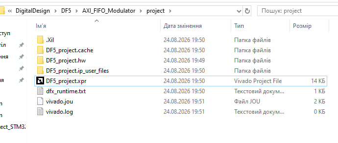

Once the project is open, the **Sources** panel in Project Manager shows every RTL file the script
picked up automatically from `sources/rtl/` — no manual "Add Sources" needed.

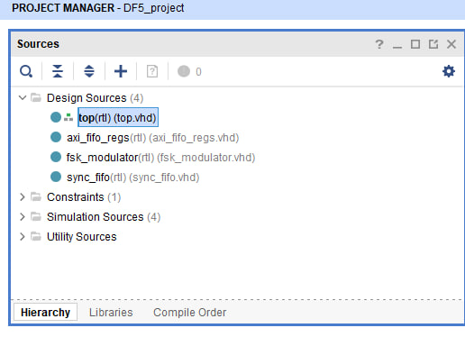

Later, when you only change RTL (not the Block Design), re-run just synthesis instead of the full
flow:

```bash
./build.bat -syn
```

or synthesis + implementation + bitstream in one go with `./build.bat -all`.

---

## 2. Creating and using a Block Design

### Why do we need a Block Design at all?

You *could* instantiate MicroBlaze and every peripheral by hand in a plain VHDL/Verilog top file —
but MicroBlaze alone needs several tightly-coupled companion IPs (debug module, reset logic, clock
generation, local memory, bus fabric — see Section 3), each with many ports that must agree with
each other exactly. Vivado's **Block Design** (IP Integrator) is a graphical canvas for wiring IP
cores together: it draws the connections, runs **Connection Automation** to auto-wire standard
signals (clocks, resets, AXI buses), and auto-generates the AXI address map instead of you
hand-computing base addresses. This is the standard way MicroBlaze/Zynq systems are built in
Vivado — not a shortcut, the *normal* flow.

### Add a Block Design

In **IP Integrator -> Create Block Design**, give it a name (e.g. `design_1`; in this project it's
called `microblaze`).

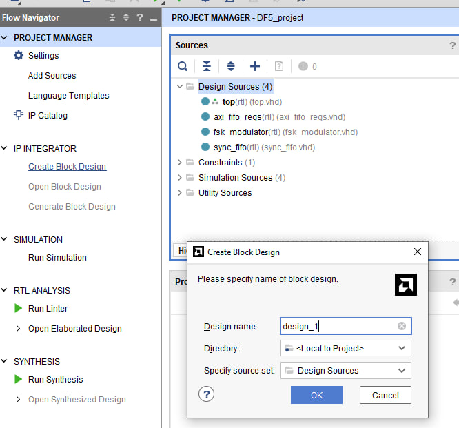

### Add an IP block

On the empty BD canvas, click **Add IP** (or press <kbd>Ctrl</kbd>+<kbd>I</kbd>) and search by
name — e.g. typing `mic` finds **MicroBlaze**, **MicroBlaze Debug Module (MDM)**, **MicroBlaze
MCS**, etc. This is how every pre-built Xilinx IP (CPU, interconnect, FIFO, GPIO, clocking wizard,
...) gets placed on the canvas.

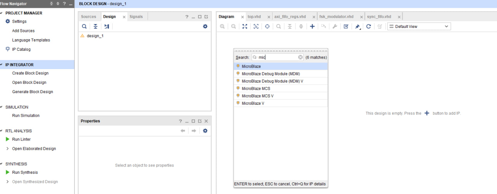

### Add your own RTL module

Your own hand-written RTL (`top.vhd`, `axi_fifo_regs.vhd`, ...) is not in the IP Catalog — instead,
right-click the canvas and choose **Add Module...** to drop an already-compiled design source
(recognized from the project's Design Sources) onto the BD as a block, with its ports exposed for
wiring. This is also where **Run Block Automation** and **Validate Design** (<kbd>F6</kbd>) live —
Validate Design checks for unconnected pins/clock-domain mistakes *before* you waste time on
synthesis.

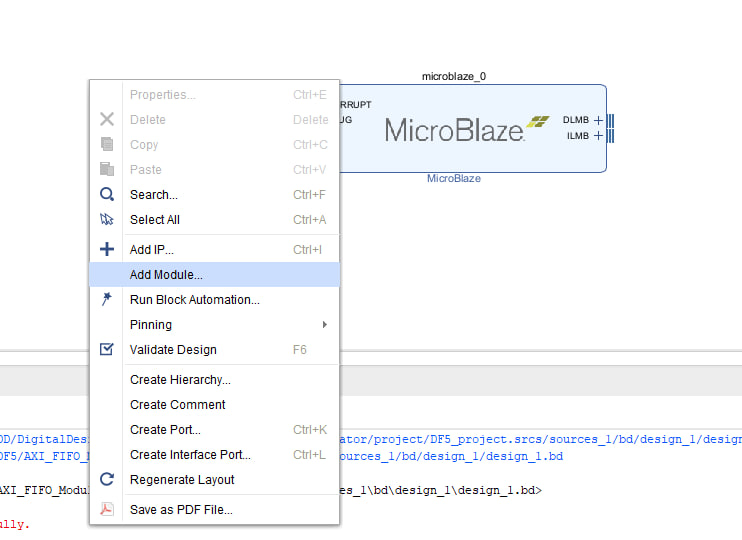

### VHDL vs. SystemVerilog in the Block Design

Plain VHDL and Verilog modules are picked up by "Add Module" out of the box. **SystemVerilog is
not** reliably supported for BD module ports in older Vivado IP Integrator flows (interfaces,
some SV-only constructs aren't understood by the BD infrastructure the same way). The practical
fix: keep the module you want to drop into the BD as VHDL/Verilog with plain `std_logic`/`wire`
ports; if you wrote it in SystemVerilog, wrap it in a thin VHDL/Verilog top module that only
translates port types, and add *that* wrapper to the BD instead.

---

## 3. Setting up MicroBlaze

MicroBlaze as a CPU does not work standing alone — it needs several companion IPs around it:

| IP | Role |
|---|---|
| **Clocking Wizard** | Generates the CPU/AXI clock from the board's input oscillator. |
| **Processor System Reset** | Synchronizes and stretches the external reset into the per-clock-domain resets MicroBlaze and the bus fabric expect (`mb_reset`, `bus_struct_reset`, `peripheral_aresetn`, ...). |
| **MicroBlaze Debug Module (MDM)** | JTAG/AXI debug and UART-over-JTAG bridge for the CPU — lets you attach a debugger and see `xil_printf` output without a physical UART. |
| **MicroBlaze Local Memory (LMB + BRAM controller)** | Fast local instruction/data memory the CPU boots from and runs code out of, connected via the Instruction/Data Local Memory Bus (`ILMB`/`DLMB`). |
| **AXI Interconnect** | The bus fabric routing AXI transactions from the CPU to every peripheral — this is the "router" described in `MicroBlaze.md` Section 5.1, and it's a **stock Vivado IP**, not hand-written RTL (see `task_readme.md`). |

Connect them together as shown:

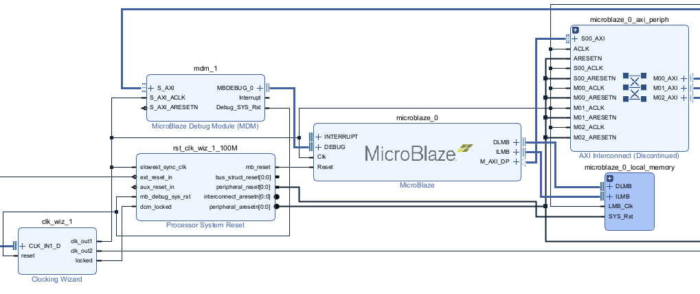

In practice you rarely wire every one of these wires by hand: after adding the IPs, Vivado shows a
green **"Run Connection Automation"** banner that wires clocks/resets/local-memory correctly for
you — do that first, then fix only what's left manually.

Once MicroBlaze and its companions are connected, wire your own peripheral(s) to a free
`AXI Interconnect` master port (`M00_AXI`, `M01_AXI`, ...) — each master port becomes one entry in
the address map (`MicroBlaze.md` Section 5.2). The screenshot below is from a similar MicroBlaze
system with two custom AXI peripherals hanging off the interconnect's `M01_AXI`/`M02_AXI` ports —
in DF5 this is where `axi_fifo_regs` gets connected.

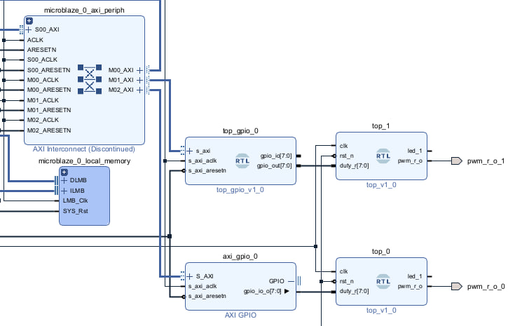

After wiring, add any external ports you need (e.g. `modulated_out`, `axi_rx_led_o` as top-level
output ports on the BD, see `task_readme.md`) and the board clock/reset, then run **Validate
Design** (<kbd>F6</kbd>). Fix every error before moving on — an unconnected AXI port or clock
domain mismatch here will otherwise surface as a much more confusing synthesis/implementation
failure later.

### Create the HDL wrapper

A Block Design (`.bd`) is not itself a top-level module you can constrain and synthesize directly —
it needs a thin auto-generated HDL wrapper around it. In the **Sources** panel, right-click the
`.bd` file and choose **Create HDL Wrapper...**.

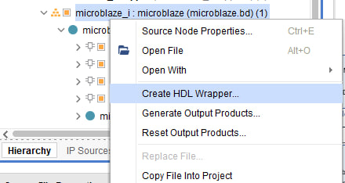

Vivado generates a wrapper module (`<bd_name>_wrapper.v`) that instantiates the Block Design and
exposes its external ports as plain top-level ports. After this, the **Sources** tree shows the
wrapper as the new top module, next to your hand-written RTL and the constraints file:

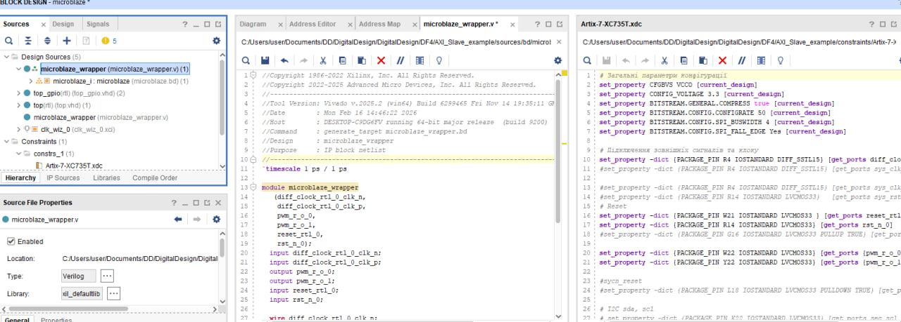

From here, the flow is the normal one:
1. Make sure every external port of the wrapper (clock, reset, `modulated_out`, `axi_rx_led_o`, ...)
   has a matching constraint in the `.xdc` — see
   [`../AXI_FIFO_Modulator/docs/scripts_and_xdc_guide.md`](../AXI_FIFO_Modulator/docs/scripts_and_xdc_guide.md#що-таке-xdc)
   for how to read/write those lines.
2. Run Synthesis, then Implementation, then generate the Bitstream (`./build.bat -all`, or
   `-syn` / `-impl -bit` individually from `scripts/`).

---

## 4. Exporting the XSA platform for Vitis

Once you have a working bitstream, MicroBlaze still needs software. Vitis builds that software
against a **hardware platform description** (`.xsa`) exported from Vivado — it encodes the address
map, peripheral list, and (optionally) the bitstream itself, and is what lets Vitis auto-generate
`xparameters.h` with the real base addresses of `axi_fifo_regs`.

Export it via **File -> Export -> Export Hardware**:

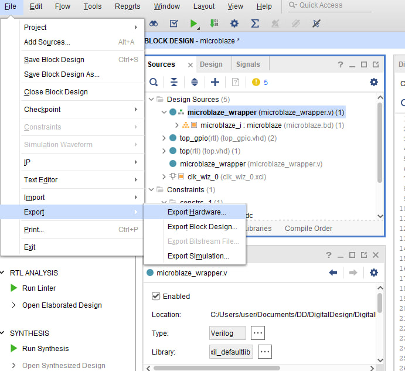

In the export dialog, choose **Include bitstream/binary** (not "Pre-synthesis") so the `.xsa`
carries the actual implemented bitstream — this is what lets Vitis program the board directly from
the platform, instead of only generating software with no way to load it.

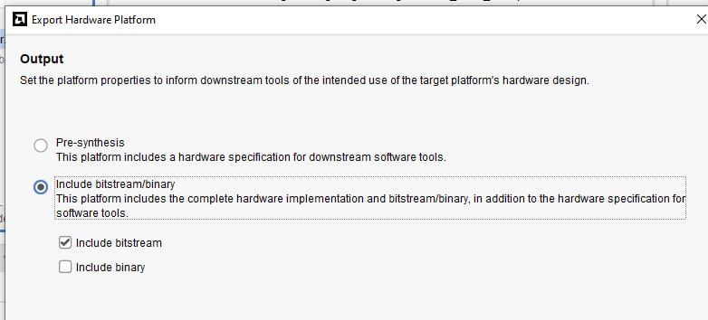

The same export can be done from the command line via the provided script:

```bash
./build.bat -xsa
```

(see `run.tcl`'s `write_hw_platform -fixed -force` call). The resulting `microblaze_wrapper.xsa`
lands in `sources/` and is the input to the Vitis flow — continue with
[`VitisFlow.md`](VitisFlow.md).
