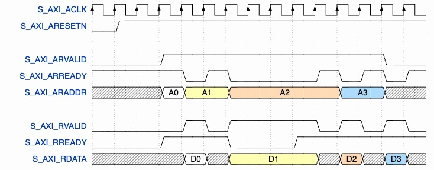

# AXI4-Stream Interface Description

## Overview

This module communicates with the surrounding system through a simplified AXI4-Stream interface.
Data transfer is based on the standard valid-ready handshake, which provides synchronous and reliable communication between the upstream source and the downstream destination.

## Key Features

### Handshake Mechanism

- `TVALID` is asserted by the transmitter when valid data is available.
- `TREADY` is asserted by the receiver when it is ready to accept data.
- A transfer occurs only when both `TVALID` and `TREADY` are asserted during the same clock cycle.

### Data Transfer

- The input interface transfers one complete 3x3 pixel window packed into a single `TDATA` word.
- The output interface transfers one processed pixel.
- The input `TDATA` width is `9 * DATA_BW`.
- The output `TDATA` width is `DATA_BW`.

### Synchronous Operation

- All AXI4-Stream interface signals are synchronous to `i_clk`.
- The active-low reset `i_rstn` returns the interface to its idle state.

## Input Stream Interface

| Signal | Direction | Description |
| --- | --- | --- |
| `i_axis_in_tdata` | Input | Packed 3x3 image window containing nine `DATA_BW`-bit pixels. |
| `i_axis_in_tvalid` | Input | Indicates that the input window is valid. |
| `o_axis_in_tready` | Output | Indicates that the module is ready to accept a new input window. |

## Output Stream Interface

| Signal | Direction | Description |
| --- | --- | --- |
| `o_axis_out_tdata` | Output | Filtered output pixel. |
| `o_axis_out_tvalid` | Output | Indicates that the output pixel is valid. |
| `i_axis_out_tready` | Input | Indicates that the downstream module is ready to accept the output pixel. |

## Handshake Protocol

- The source asserts `TVALID` whenever a valid transaction is available.
- The receiver asserts `TREADY` whenever it can accept new data.
- Data is transferred only when both `TVALID` and `TREADY` are asserted on the rising edge of `i_clk`.
- If `TREADY` is deasserted, the source must keep both `TVALID` asserted and `TDATA` unchanged until the transfer completes.
- If `TVALID` is deasserted, no transfer occurs regardless of the value of `TREADY`.

## Protocol Requirements

- `TDATA` shall remain stable while `TVALID` is asserted and `TREADY` is deasserted.
- `TVALID` shall remain asserted until the current transfer is accepted.
- During reset (`i_rstn = 0`), the module shall deassert all output handshake signals and discard any pending transaction.
- The configuration signal `i_config_select` is sampled together with the input transaction when the input handshake (`i_axis_in_tvalid && o_axis_in_tready`) occurs, allowing the filter type to change dynamically between successive image windows.